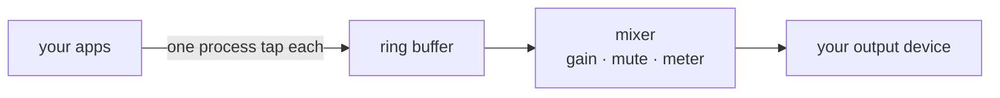

# VolumeMixer

Per-app volume for macOS. A row per app, with its own slider, mute button and live
level meter — no virtual audio driver, no kernel extension.

Built on Core Audio process taps. Your output device, its volume and its selection
stay under your control; only the *mixing* of app audio is replaced.

Requires **macOS 14.2 or newer**.

## Install

1. Download the **VolumeMixer** disk image from
   [Releases](https://github.com/farukoguz/VolumeMixer/releases) and open it.

   Check it before you go any further — this build is not notarised, so macOS has
   no way to tell you whether what you downloaded is what was published:

   ```sh
   shasum -a 256 -c VolumeMixer-*.dmg.sha256   # run in ~/Downloads
   ```

   The filename has to match the checksum exactly. A mismatch means the download
   is truncated or altered — do not open it. The `.sha256` file sits next to the
   image on the release page.
2. Drag **Volume Mixer** onto the **Applications** shortcut, then eject the disk.
3. Clear the quarantine flag. This build is not notarised, so macOS refuses it
   before anything inside it gets a chance to run:

   ```sh
   /usr/bin/xattr -cr /Applications/VolumeMixer.app
   ```

   Then launch Volume Mixer normally.

   This removes macOS's record of where the app came from, so macOS can no longer
   warn you about an unnotarised build. Only run it on an app you built yourself or
   checked against the release checksum.

   Prefer the mouse? Right-click Volume Mixer in Applications and choose **Open**
   instead. macOS remembers that choice, but it does not always clear the flag on
   everything inside the bundle, so the command above is the reliable one.
4. System Settings → Privacy & Security → **Screen & System Audio Recording** →
   add Volume Mixer.

Volume Mixer then lives in the menu bar, not the Dock — look for the speaker icon
next to the clock.

> **If a slider does nothing, step 4 is almost certainly why.** The app launches and
> lists whatever is playing, so a missing permission looks like a broken app rather
> than a misconfigured one. Nothing reports an error.

To uninstall, drag it from Applications to the Trash.

## How it works



Every app that makes noise gets its own tap and its own row. The tap mutes only
that process, the mixer reads all the rings and applies your gain, then writes to
the default output. Your device stays the default and keeps its own volume control
— only the *mixing* is replaced.

There is no virtual audio driver, no kernel extension, and nothing installed at the
system level.

## Customising the look

The UI is deliberately **not themed** — it follows macOS. Every colour it uses is a
system semantic colour (`.secondary`, `.green`, `.yellow`, `.red`), so it picks up
light/dark appearance, increased contrast and your accent colour from System
Settings with no code of its own. There is no theme object, no style file and no
colour injection point; `settings.json` holds per-app levels and mute state only.

To restyle it, edit [`MixerView`](Sources/VolumeMixer/UI/MixerView.swift) and swap
those semantic colours for your own.

## Build from source

```sh
swift test              # 75 tests, no audio hardware needed
./Scripts/build-app.sh  # assembles build/VolumeMixer.app
```

No certificate is needed; the build signs ad-hoc unless the keychain has one.

For how it works and why, see [docs/architecture.md](docs/architecture.md).

## Known limitations

- **Per-browser-tab volume is not possible.** Chromium mixes every tab in one
  process, so you get one row for the browser.
- **Several instances of one app share a row and a level.**
- **Output devices that are not float32 are rejected** rather than converted.
- **Does not affect DRM output** or an app's own offline rendering.

## Licence

MIT.
